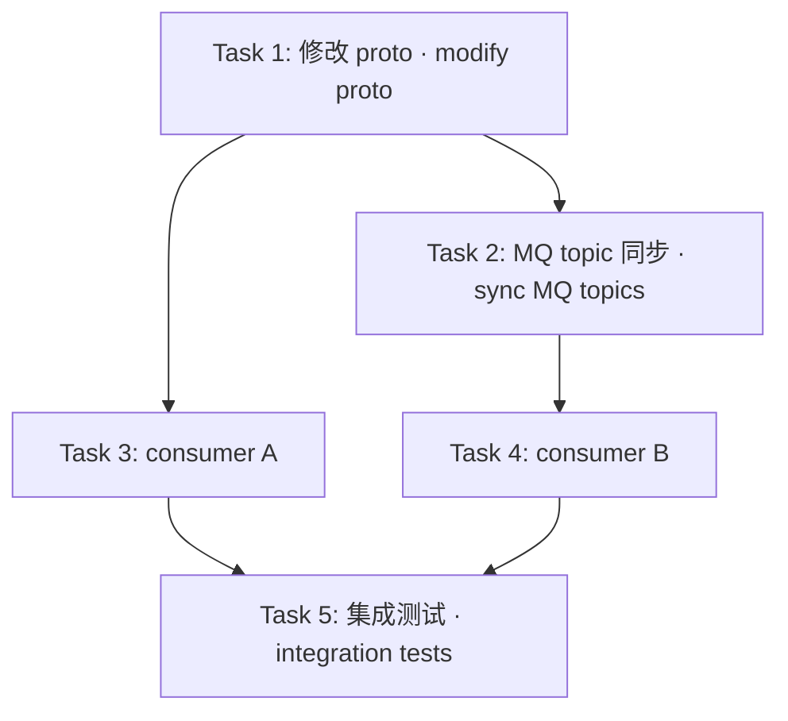

# prd-to-tasks Redesign Implementation Plan

> **For agentic workers:** REQUIRED SUB-SKILL: Use superpowers:subagent-driven-development (recommended) or superpowers:executing-plans to implement this plan task-by-task. Steps use checkbox (`- [ ]`) syntax for tracking.

**Goal:** 把 `skills/prd-to-tasks/` 升级为开源、可演进的 PRD→Tasks skill：注入门控刚性化 / PM 内容质量 / 路由 hand-off 契约 / 任务粒度可执行性 / 知识库外部化 5 个主题，并清理所有公司内部专有标识。

**Architecture:** 增量改造现有 6 阶段架构（Phase 0–5 不变）。在 `skills/prd-to-tasks/SKILL.md` 内分阶段注入 HARD-GATE + 自检 checklist + 升级版模板（Spec/Plan frontmatter、Boundaries 三段、XS-XL、spec-refs、任务 DAG）。`references/*.md` 重写为行业通用 seed 并标注为可演进的 KB 起点。引入 3 层 KB 加载（项目级 → 用户级 → skill seed）。通过 `dist/prd-to-tasks.skill` 重建分发包。

**Tech Stack:** Markdown（SKILL.md / references）、YAML frontmatter、Bash（验证脚本 / zip 打包）、Mermaid（任务 DAG 渲染）。无运行时代码 — 所有"测试"以 grep 验证 markdown 内容契约的形式存在。

**Spec reference:** `docs/superpowers/specs/2026-05-14-prd-to-tasks-redesign-design.md`

**Key decisions locked in by spec:**
- KB 加载顺序冲突时取 **override** 语义（spec Q4 已建议，本 plan 按 override 实施）
- Seed 文件选择 **generic e-commerce** domain（spec Q5 已建议）
- 默认 Spec 路径：`docs/superpowers/specs/YYYY-MM-DD-<feature>-design.md`
- 默认 Plan 路径：`docs/superpowers/plans/YYYY-MM-DD-<feature>-tasks.md`
- HARD-GATE 应用于 Phase 1 / 3 / 4

---

## File Structure

```
skills/prd-to-tasks/
├── SKILL.md                          # 主体 — 9 节升级（详见各 Task）
└── references/
    ├── repo-map.md                   # 全文重写为 generic e-commerce
    └── service-patterns.md           # 全文重写为抽象原则模板

dist/
└── prd-to-tasks.skill                # zip 重建

scripts/
└── verify-prd-to-tasks.sh            # 新建 — 全量验证脚本
```

每个 Task 的 "verify" 步骤跑 `scripts/verify-prd-to-tasks.sh`，按 Task 阶段递增 grep 检查。

---

### Task 1: 构建验证 harness + SKILL.md frontmatter 与开头示例清理

**Files:**
- Create: `scripts/verify-prd-to-tasks.sh`
- Modify: `skills/prd-to-tasks/SKILL.md:1-35`（description + 开头示例段）

- [ ] **Step 1: 写验证脚本骨架（先放 9 项检查，所有项均预期 fail）**

Create `scripts/verify-prd-to-tasks.sh`:

```bash
#!/usr/bin/env bash
# Verifies prd-to-tasks skill redesign artifacts meet the contract in
# docs/superpowers/specs/2026-05-14-prd-to-tasks-redesign-design.md
set -u
SKILL=skills/prd-to-tasks/SKILL.md
REPO_MAP=skills/prd-to-tasks/references/repo-map.md
PATTERNS=skills/prd-to-tasks/references/service-patterns.md
BUNDLE=dist/prd-to-tasks.skill
FAIL=0

# Forbidden company-internal identifiers (must NOT appear anywhere in open-source artifacts)
FORBIDDEN='idgen\.NextID|cache\.DoubleDelete|BrokerTopics|KafkaTopics|order\.booking\.created|internal/facade/mq/topic\.go|klook\.com|jake\.li@klook'

check() {
    local label="$1" cmd="$2" expect="$3"
    actual=$(eval "$cmd" 2>/dev/null || echo "0")
    if [[ "$expect" == "gt0" && "$actual" -gt 0 ]]; then
        echo "✅ $label  (matches=$actual)"
    elif [[ "$expect" == "eq0" && "$actual" -eq 0 ]]; then
        echo "✅ $label  (no matches, as expected)"
    else
        echo "❌ $label  (expected $expect, got $actual)"
        FAIL=$((FAIL+1))
    fi
}

echo "=== Task 1: frontmatter + Phase 0 cleanup ==="
check "SKILL.md: no forbidden klook identifiers in description (lines 1-15)" \
      "sed -n '1,15p' $SKILL | grep -cE '$FORBIDDEN'" eq0
check "SKILL.md: no klook identifiers in opening example (lines 16-40)" \
      "sed -n '16,40p' $SKILL | grep -cE '$FORBIDDEN'" eq0

echo "=== Task 2: Phase 1 ==="
check "SKILL.md: contains 'PM 范围澄清清单'" \
      "grep -c 'PM 范围澄清清单' $SKILL" gt0
check "SKILL.md: contains 'HARD-GATE' (≥3 instances for Phase 1/3/4)" \
      "grep -c '<HARD-GATE>' $SKILL" gt0
check "SKILL.md: Phase 1 risk format has 考虑过的备选" \
      "grep -c '考虑过的备选\\|考虑过' $SKILL" gt0

echo "=== Task 3: Phase 2 ==="
check "SKILL.md: scan output has confidence column" \
      "grep -c 'confidence' $SKILL" gt0
check "SKILL.md: mentions LSP fallback" \
      "grep -cE 'LSP|gopls|pyright|typescript-language-server' $SKILL" gt0

echo "=== Task 4: Phase 3 ==="
check "SKILL.md: spec template has frontmatter (yaml fence)" \
      "grep -cE '^feature: ' $SKILL" gt0
check "SKILL.md: spec template has Boundaries 三段 / Always do / Never do" \
      "grep -cE 'Always do|Never do' $SKILL" gt0
check "SKILL.md: Spec default path is docs/superpowers/specs/" \
      "grep -c 'docs/superpowers/specs/' $SKILL" gt0

echo "=== Task 5: Phase 4 ==="
check "SKILL.md: sizing uses XS-XL" \
      "grep -cE '\\bXS\\b' $SKILL" gt0
check "SKILL.md: task has spec-refs:" \
      "grep -c 'spec-refs' $SKILL" gt0
check "SKILL.md: contains mermaid task DAG section" \
      "grep -cE '\`\`\`mermaid' $SKILL" gt0
check "SKILL.md: Plan default path is docs/superpowers/plans/" \
      "grep -c 'docs/superpowers/plans/' $SKILL" gt0
check "SKILL.md: plan frontmatter has routed-to field" \
      "grep -c 'routed-to:' $SKILL" gt0

echo "=== Task 6: Phase 5 + KB section ==="
check "SKILL.md: has Knowledge Base section" \
      "grep -cE '知识库|Knowledge Base' $SKILL" gt0
check "SKILL.md: documents 3-layer KB loading order" \
      "grep -cE '~/.claude/prd-to-tasks|.claude/prd-to-tasks' $SKILL" gt0

echo "=== Task 7-8: References cleanup ==="
check "repo-map.md: has 'Generic example' banner" \
      "head -5 $REPO_MAP | grep -ciE 'generic.*example|industry.*neutral'" gt0
check "repo-map.md: no klook-internal identifiers" \
      "grep -cE '$FORBIDDEN' $REPO_MAP" eq0
check "service-patterns.md: has 'Generic example' banner" \
      "head -5 $PATTERNS | grep -ciE 'generic.*example|industry.*neutral'" gt0
check "service-patterns.md: no klook-internal identifiers" \
      "grep -cE '$FORBIDDEN' $PATTERNS" eq0

echo "=== Task 9: Bundle ==="
check "dist/prd-to-tasks.skill bundle exists" \
      "[[ -f $BUNDLE ]] && echo 1 || echo 0" gt0
check "Bundle contains SKILL.md" \
      "[[ -f $BUNDLE ]] && unzip -l $BUNDLE 2>/dev/null | grep -c 'SKILL.md' || echo 0" gt0

echo ""
if [[ $FAIL -eq 0 ]]; then
    echo "All checks passed ✅"
    exit 0
else
    echo "$FAIL check(s) failed ❌"
    exit 1
fi
```

- [ ] **Step 2: 让脚本可执行 + 先跑一遍（预期全 fail）**

Run:
```bash
chmod +x scripts/verify-prd-to-tasks.sh
./scripts/verify-prd-to-tasks.sh
```

Expected output: most checks fail（特别是 `PM 范围澄清清单`、`<HARD-GATE>`、`XS-XL`、`spec-refs`、`mermaid`、`routed-to:`、KB section 等都不存在）。Task 1 自身的两个 forbidden 检查会 fail，因为当前 SKILL.md 描述里有 `bff-service / order-service / platform-order-service` 以及示例里有 `idgen.NextID` / `cache.DoubleDelete` 等。

- [ ] **Step 3: 清理 SKILL.md 的 description 与开头示例（行 1-35）**

Edit `skills/prd-to-tasks/SKILL.md` lines 3-12 — replace description to remove klook-specific service mentions:

```markdown
---
name: prd-to-tasks
description: "Translates a PRD / requirements document into codebase-aware engineering tasks, then routes to the right development workflow based on risk level.

Use this skill for any PRD / requirements document → engineering task conversion scenario. Even if the user just says 'help me analyze this requirement', 'break this PRD into tasks', 'the PM sent a requirements doc', or 'we need to build this feature for the sprint' — invoke this skill immediately, don't ask questions first.

Core difference from generic spec-driven-development:
(1) Scans the real codebase (services / interfaces / DB tables / MQ topics) using a user-maintained knowledge base — see ~/.claude/prd-to-tasks/ for your stack-specific mappings;
(2) Each task produced includes real file paths + line numbers + references to project-specific code patterns from your knowledge base;
(3) Automatically routes to cross-verified-feature-development or the standard superpowers workflow based on risk level.

Trigger phrases: PRD, requirements document, feature analysis, functional breakdown, sprint tasks, break down tasks, analyze requirements, how do we implement this, how should we build this."
---
```

And replace lines 27-32 (the example tasks in "What Problem This Skill Solves") with a generic example:

```markdown
本 skill 写出来的任务是：
> 在 `order-service/internal/service/booking/booking_service.go:142` 的 `CreateBooking` 方法中加入 feature flag 检查，flag key 为 `new_order_flow_enabled`，使用项目 KB（`~/.claude/prd-to-tasks/service-patterns.md`）中记录的 ID 生成 helper 创建新单据 ID，写入数据库，写后按项目缓存失效协议执行失效 — 然后跑项目约定的 `build` + `test` 命令。

This skill produces tasks like:
> In the `CreateBooking` method at `order-service/internal/service/booking/booking_service.go:142`, add a feature flag check with key `new_order_flow_enabled`, use the ID generation helper documented in your project's KB (`~/.claude/prd-to-tasks/service-patterns.md`) to create the new record ID, write to the database, then execute your project's cache invalidation discipline — then run your project's `build` + `test` commands.
```

(Note: `order-service` is industry-neutral; the klook removal is the `idgen.NextID` / `cache.DoubleDelete` API names → replaced by "ID generation helper" / "cache invalidation discipline".)

- [ ] **Step 4: 验证 Task 1 的 2 项 forbidden 检查通过**

Run:
```bash
./scripts/verify-prd-to-tasks.sh 2>&1 | grep -A0 "Task 1"
./scripts/verify-prd-to-tasks.sh 2>&1 | grep -cE "✅.*frontmatter|✅.*opening example"
```
Expected: both Task 1 checks now ✅.

- [ ] **Step 5: Commit**

```bash
git add scripts/verify-prd-to-tasks.sh skills/prd-to-tasks/SKILL.md
git commit -m "feat(prd-to-tasks): verification harness + open-source description cleanup"
```

---

### Task 2: Phase 1 — PM 检查清单 + 风险定级格式 + HARD-GATE + 自检

**Files:**
- Modify: `skills/prd-to-tasks/SKILL.md:85-140` (Phase 1 section)

- [ ] **Step 1: 加入 Phase 2 的 verify 检查（已在 Task 1 脚本中预置；先跑一次确认 fail）**

Run:
```bash
./scripts/verify-prd-to-tasks.sh 2>&1 | grep -E "Phase 1|PM 范围|HARD-GATE|备选"
```
Expected: 3 checks fail（`PM 范围澄清清单` / `<HARD-GATE>` / `考虑过的备选`）。

- [ ] **Step 2: 替换 Phase 1.2 "向用户澄清的问题模板" 为 PM 检查清单**

Locate Phase 1.2 section（around line 104）. Replace the existing 3-question template block with:

```markdown
#### 1.2 PM 范围澄清清单 · PM Scope-Clarity Checklist

在问任何技术问题之前，先把你能从 PRD 和代码库中自行推断的信息全列出来（"我假设..." 格式），然后只问**无法自行判断**的事项。

Before asking any technical questions, list everything you can infer from the PRD and codebase ("I assume..." format), then only ask about what you **cannot determine yourself**.

逐项填写或注明 "PRD 已覆盖"。任何空项必须形成 Open Question 提给用户。
Fill in each item or mark "covered by PRD". Any blank must become an Open Question to the user.

| # | 维度 · Dimension | 输出要求 · Output Requirement |
|---|------------------|------------------------------|
| 1 | **JTBD** (Job-to-be-done) | 谁在什么场景下用，要解决什么痛点（不是"实现 X 功能"，而是"让 Y 用户在 Z 情境下能做到 W"） · Who uses it in what context, what pain it solves (not "implement X", but "enable Y user in Z context to do W") |
| 2 | **In scope** | 本期必做的可枚举能力清单 · Enumerable capabilities required this iteration |
| 3 | **Not Doing** | 显式排除的能力（防止范围蔓延） · Explicitly excluded capabilities (scope-creep guard) |
| 4 | **Deferred to v2** | 推迟到下一版的能力 + 推迟理由 · Capabilities deferred + reason |
| 5 | **成功指标 · Success Metrics** | 业务指标（如转化率 +X%）+ 技术指标（如 p99 < Yms），均需可量化 · Business metric (e.g. conversion +X%) + technical metric (e.g. p99 < Yms), both quantifiable |
| 6 | **使用者主路径 · User Happy Path** | happy path 的用户操作序列 · User operation sequence on happy path |
| 7 | **极端失败模式 · Worst-case Failure** | 最坏情况：什么会坏 + 谁/什么会受伤 + 影响半径 · Worst case: what breaks, who/what is harmed, blast radius |
| 8 | **回滚指标 · Rollback Trigger** | 哪个 metric 超阈值触发回滚 + 谁决定 + 耗时 · Which metric anomaly triggers rollback, who decides, time-to-rollback |
| 9 | **上下游依赖 · Upstream/Downstream** | 其他团队/服务的同步要求 · Synchronization requirements with other teams/services |
| 10 | **合规/审计 · Compliance/Audit** | PII / GDPR / 资金审计 / 操作日志要求 · PII, GDPR, financial audit, operation log requirements |
```

- [ ] **Step 3: 升级 Phase 1.3 风险定级的输出格式（加备选+行号）**

Locate Phase 1.3 section（after the risk classification table）. Append after the existing matrix:

```markdown
**Phase 1 输出格式 · Phase 1 Output Format:**

```
我的初步判断（基于 PRD + 代码库扫描）· My initial assessment (based on PRD + codebase scan):
[每条用 "我假设 ..." 开头 · Each starts with "I assume ..."]

仍需你确认的 Open Questions · Still need your confirmation:
[只列 PM 清单中我无法自答的项 · Only list items I cannot self-answer from the PM checklist]

风险定级初判 · Initial risk classification: 🔴 Critical
[理由 · Reason: 触发 Phase 1.3 矩阵第 1 行（资金流 / 退款 / 余额）]
[考虑过的备选 · Alternatives considered: 🟡 High, but rejected because lacks cross-service contract change]
```

记录"考虑过的备选定级 + 排除理由"是事后回看"为什么走了 cross-verified-feature-development"时的审计线索。
Recording "considered alternative classification + rejection reason" provides an audit trail for retrospective review.
```

- [ ] **Step 4: 在 Phase 1 末尾插入 HARD-GATE 块 + 自检 checklist**

Append at the very end of Phase 1 section (before the `---` separator that leads to Phase 2):

```markdown
#### 1.4 Phase 1 自检 checklist · Self-check before gate

提交给用户前自动跑：
Run automatically before presenting to user:

- [ ] 用了 Phase 1.3 矩阵的具体行号作为定级理由 · Used a specific Phase 1.3 matrix row as the rationale
- [ ] 至少考虑了 1 个备选定级并写出排除理由 · Considered at least 1 alternative classification with rejection reason
- [ ] 🔴 触发关键词（资金 / 状态机 / MQ / schema / 锁 / 跨服务契约）显式列出 · 🔴 trigger keywords explicitly listed
- [ ] PM 检查清单 10 项无未答项（已答 or 已转 Open Question） · All 10 PM checklist items answered or converted to Open Question

任何 ❌ 必须自动尝试修复或显式 acknowledge 才能进入下一阶段。
Any ❌ must be auto-fixed or explicitly acknowledged before proceeding.

<HARD-GATE>
不得进入 Phase 2，除非用户**显式**输入有效批准信号。
有效信号：「approve Phase 1」/「确认 Phase 1」/「Phase 1 OK，继续」。
无效信号（仅为会话寒暄，禁止当作批准）：「看起来不错」「continue」「嗯」「ok」「好的」「就这样」。

Do NOT proceed to Phase 2 unless the user provides an **explicit** valid approval signal.
Valid signals: "approve Phase 1" / "确认 Phase 1" / "Phase 1 OK, continue".
Invalid signals (conversational acknowledgements, NOT approval): "looks good" / "continue" / "ok" / "好的" / "嗯".
</HARD-GATE>
```

- [ ] **Step 5: Verify + Commit**

Run:
```bash
./scripts/verify-prd-to-tasks.sh 2>&1 | grep -E "PM 范围|HARD-GATE|备选"
```
Expected: 3 Phase-1-related checks now ✅.

```bash
git add skills/prd-to-tasks/SKILL.md
git commit -m "feat(prd-to-tasks): Phase 1 PM checklist + hard-gate + risk audit trail"
```

---

### Task 3: Phase 2 — confidence 列 + LSP 提示 + KB 演进协议

**Files:**
- Modify: `skills/prd-to-tasks/SKILL.md` Phase 2 section (around lines 140-210)

- [ ] **Step 1: Run verify to confirm Phase 2 checks fail**

```bash
./scripts/verify-prd-to-tasks.sh 2>&1 | grep -E "confidence|LSP"
```
Expected: both checks fail.

- [ ] **Step 2: 在 Phase 2 扫描脚本块之前插入 LSP 软优先级注释**

Locate the comment introducing Phase 2.1 "扫描优先级 · Scan Priority". Insert before the bash code block:

```markdown
**工具优先级 · Tool Priority**：

如目标语言的 LSP 服务可用（如 Go 的 `gopls`、Python 的 `pyright`、TypeScript 的 `typescript-language-server`），**优先**用 LSP 的 references / implementations / call hierarchy 调用替代 grep — LSP 能解析 symbol 语义，grep 容易漏识别接口实现关系。LSP 不可用时降级为下面的 grep + find 组合。

If target-language LSP is available (e.g. `gopls` for Go, `pyright` for Python, `typescript-language-server` for TypeScript), **prefer** LSP `references` / `implementations` / `call hierarchy` calls over grep — LSP resolves symbol semantics, while grep often misses interface-implementation relations. Fall back to the grep + find combo below if LSP is unavailable.
```

- [ ] **Step 3: 给 Phase 2.2 "扫描产出" 的表格新增 confidence 列**

Locate Phase 2.2 "扫描产出 · Scan Output" section. Replace the existing "受影响文件（初步）" code block with:

```markdown
整理出一张**受影响范围表**（含 confidence 列）：
Produce an **affected scope table** (with confidence column):

| 文件 File | 影响类型 Impact | 改动点 Change | Confidence |
|----------|----------------|--------------|------------|
| `order-service/internal/service/booking/booking_service.go` | 修改 modify | `CreateBooking()`: 加入 feature flag 分支 · add feature flag branch | 高 high — directly named in PRD |
| `order-service/internal/facade/mq/topic.go` | 修改 modify | MQ topic 注册表需同步新增 topic · MQ topic registries need new topic in sync | 中 medium — pattern-matched from KB |
| `<shared-contracts-repo>/proto/order.proto` | 修改? modify? | 待确认是否需要新增字段 · pending confirmation on new field | 低 low — needs user input |
| `platform-order-service/internal/service/order_v2/` | 新增消费者 new consumer | new file required | 高 high |

`confidence` 列三个值：
- **高 / high**：PRD 直接点名、或 KB 中有精确模式匹配
- **中 / medium**：模式推断，需要 Phase 3 spec 中再确认
- **低 / low**：仅初步假设，须形成 Open Question
```

- [ ] **Step 4: 在 Phase 2 末尾插入 KB 演进协议**

Append at the end of Phase 2 (before `---`):

```markdown
#### 2.3 KB 演进协议 · Knowledge Base Evolution Protocol

扫描结束后，对每个**未在当前 KB 中**找到对应映射的服务/模式，列出"候选新 KB 条目"清单：

After scanning, for each service/pattern not found in the currently loaded KB, list a "candidate new KB entry":

```
扫描发现以下新映射，KB 中尚无对应条目。要追加到 ~/.claude/prd-to-tasks/repo-map.md 吗？
Discovered the following new mappings; no corresponding entries in KB. Append to ~/.claude/prd-to-tasks/repo-map.md?

候选条目 · Candidate entries:
- "<requirement-signal>" → <service-name>  [user 确认 add / skip]
- "<another-signal>" → <another-service>   [user 确认 add / skip]
```

**规则 · Rule**：
- 用户必须**显式同意**才会写入（与 HARD-GATE 协议一致）· User must give explicit approval (same as HARD-GATE protocol)
- 本 skill **永不静默写入 KB** · This skill **never silently writes to KB**
- 写入时显示完整 diff 给用户 · Show full diff to user before write
- 默认写入 `~/.claude/prd-to-tasks/`（用户级）；如检测到项目级 `.claude/prd-to-tasks/` 存在且更适合，询问写哪一层 · Default write target is user-level; if project-level KB exists and seems more appropriate, ask which layer to write
```

- [ ] **Step 5: Verify + Commit**

```bash
./scripts/verify-prd-to-tasks.sh 2>&1 | grep -E "confidence|LSP"
git add skills/prd-to-tasks/SKILL.md
git commit -m "feat(prd-to-tasks): Phase 2 confidence column + LSP priority + KB evolution"
```

Expected: both Phase 2 checks ✅.

---

### Task 4: Phase 3 — Spec 模板升级 + HARD-GATE + 自检

**Files:**
- Modify: `skills/prd-to-tasks/SKILL.md` Phase 3 section (around lines 210-280)

- [ ] **Step 1: Run verify to confirm Phase 3 checks fail**

```bash
./scripts/verify-prd-to-tasks.sh 2>&1 | grep -E "frontmatter|Boundaries|docs/superpowers/specs"
```
Expected: 3 checks fail.

- [ ] **Step 2: 改默认存盘路径 + 插入 frontmatter 段**

Locate the Phase 3 line `**默认保存到 · Default save path**：`docs/specs/YYYY-MM-DD-<feature-name>.md`...`. Replace with:

```markdown
**默认保存到 · Default save path**：`docs/superpowers/specs/YYYY-MM-DD-<feature>-design.md`（以 CWD 为根 · rooted at CWD）。

下游 skill 凭固定路径取货（参见 Phase 5 路由 hand-off 契约）。
Downstream skills consume by fixed path (see Phase 5 routing hand-off contract).
```

Then locate the line `**Spec 模板 · Spec Template:**` and replace the entire spec template code block with the new version. The new template begins with a YAML frontmatter and includes Boundaries 三段:

````markdown
**Spec 模板 · Spec Template:**

```markdown
---
feature: <kebab-case-name>
prd-source: lark://docx/xxx 或 docs/prd/xxx.md 或 inline
risk-level: 🔴 Critical | 🟡 High | 🟢 Standard
affected-repos: [repo-a, repo-b]
spec-status: draft | approved | superseded
created: YYYY-MM-DD
owner: <handle-or-email>
---

# Spec: <Feature Name>

## 业务目标 · Business Goal
[PRD 核心目标 + 验收标准 · PRD core objectives + acceptance criteria]

## 受影响的服务与仓库 · Affected Services & Repos
| 服务 Service | 仓库 Repo | 影响类型 Impact Type |
|-------------|----------|---------------------|

## 技术方案 · Technical Approach
[核心技术路径 · Core technical path]

## 边界 · Boundaries

### Always do · 必做（不需要再问 · no further confirmation needed）
- B-Always-1: ...
- B-Always-2: ...

### Ask first · 先问再做（人在回路 · human-in-the-loop）
- B-AskFirst-1: ...

### Never do · 严禁（红线 · red line）
- B-Never-1: ...

(每条带 ID，用于 Phase 4 task 反向引用 · Each entry has an ID for Phase 4 task back-references)

## API 契约变更 · API Contract Changes
[如有新增/修改接口 · If any new/modified interfaces]

## 数据模型变更 · Data Model Changes
[DB schema diff / proto field 变更 · DB schema diff / proto field changes]

## 不变式清单 · Invariants
- I-1: ...
- I-2: ...
(每条带 ID，用于 task 反向引用 · Each entry has an ID for task back-references)

## 失败模式分析 · Failure Mode Analysis
[至少 4 种：正常路径崩溃 / 重试覆盖 / 并发竞态 / 下游超时
 At least 4: happy-path crash / retry idempotency / concurrent race / downstream timeout]

## 部署策略 · Deployment Strategy
[ ] 全量 Full rollout
[ ] Feature Flag（key: ___）
[ ] 灰度 Canary（比例 percentage: ___）
[ ] 双写切换 Dual-write switch

## 风险层级 · Risk Level
🔴 Critical / 🟡 High / 🟢 Standard（见 Phase 1.3 · see Phase 1.3）

## 回滚标准 · Rollback Criteria
[什么指标异常时触发回滚，谁来决定 · Which metric triggers rollback, who decides]

## 成功标准 · Success Criteria
[具体可测量的完成条件 · Specific measurable completion conditions]

## 遗留问题 · Open Questions

| # | 问题 Question | 影响 Impact | Owner | Deadline | 状态 Status |
|---|--------------|------------|-------|----------|------------|
| Q1 | ... | ... | @user | YYYY-MM-DD | open |
```
````

- [ ] **Step 3: 在 Phase 3 末尾插入自检 checklist + HARD-GATE**

Replace the existing `**门控 · Gate**` line at end of Phase 3 with:

```markdown
#### 3.1 Phase 3 自检 checklist · Self-check before gate

写完 spec 后、展示给用户前，自动跑：
After writing the spec, before showing to user, run automatically:

- [ ] Placeholder 扫描：无 "TBD" / "TODO" / "待确认" / "??"  · Placeholder scan
- [ ] 内部一致性：技术方案 ↔ API 契约 ↔ 数据模型 三处无矛盾 · Internal consistency
- [ ] 范围一致性：Boundaries 三段 ↔ JTBD + In/Not Doing/v2 无矛盾 · Scope consistency
- [ ] 风险定级与 "风险层级" 节描述一致 · Risk level consistency
- [ ] 每条 Boundary / Invariant 至少映射到 1 个技术决策 · Every Boundary/Invariant maps to ≥1 tech decision
- [ ] Open Questions 无 owner 缺失项；无 deadline 缺失项 · Open Questions have owners + deadlines
- [ ] frontmatter 完整：feature / prd-source / risk-level / affected-repos / owner · Frontmatter complete

任何 ❌ 先自动尝试修复；不能修复的转为新 Open Question 提给用户。
Any ❌ — auto-fix first; if unfixable, convert to a new Open Question for user.

<HARD-GATE>
不得进入 Phase 4，除非用户**显式**输入有效批准信号。
有效信号：「approve Phase 3」/「确认 Phase 3」/「Phase 3 OK，继续」。
无效信号（仅为会话寒暄，禁止当作批准）：「看起来不错」「continue」「嗯」「ok」「好的」「就这样」。

Do NOT proceed to Phase 4 unless the user provides an **explicit** valid approval signal.
Valid signals: "approve Phase 3" / "确认 Phase 3" / "Phase 3 OK, continue".
Invalid signals: "looks good" / "continue" / "ok" / "好的" / "嗯".
</HARD-GATE>
```

- [ ] **Step 4: Verify + Commit**

```bash
./scripts/verify-prd-to-tasks.sh 2>&1 | grep -E "frontmatter|Boundaries|specs/"
git add skills/prd-to-tasks/SKILL.md
git commit -m "feat(prd-to-tasks): Phase 3 spec template upgrade (frontmatter + Boundaries + hard-gate)"
```

Expected: 3 Phase 3 checks ✅.

---

### Task 5: Phase 4 — 任务结构升级 + Plan frontmatter + HARD-GATE

**Files:**
- Modify: `skills/prd-to-tasks/SKILL.md` Phase 4 section (around lines 280-340)

- [ ] **Step 1: Run verify to confirm Phase 4 checks fail**

```bash
./scripts/verify-prd-to-tasks.sh 2>&1 | grep -E "XS|spec-refs|mermaid|routed-to|plans/"
```
Expected: 5 checks fail.

- [ ] **Step 2: 改默认存盘路径**

Replace `**默认保存到**` (or equivalent) at Phase 4 introduction with:

```markdown
**默认保存到 · Default save path**：`docs/superpowers/plans/YYYY-MM-DD-<feature>-tasks.md`（以 CWD 为根 · rooted at CWD）。

Plan 文件顶部必须带机读 frontmatter（Phase 5 路由 hand-off 契约的实际载体 · the actual carrier of the Phase 5 routing hand-off contract）。
```

- [ ] **Step 3: 插入 Plan 文件 frontmatter 模板**

After the path note above, insert a new sub-section before 4.1:

```markdown
#### 4.0 Plan 文件 frontmatter · Plan File Frontmatter

Plan 文件最开头必带 YAML frontmatter，下游 skill 凭此路由：

```yaml
---
feature: <kebab-case-name>
risk-level: 🔴 Critical | 🟡 High | 🟢 Standard
routed-to: cross-verified-feature-development | superpowers:writing-plans | direct
spec: ../specs/YYYY-MM-DD-<feature>-design.md
routed-rationale: |
  Selected <skill> because [...]
  Considered <alternative> but rejected: [...]
  Expected cost: [...]
plan-status: ready-for-execution
phase-gate-approvals:
  phase-1: { approved-at: "YYYY-MM-DD HH:MM", phrase: "approve Phase 1" }
  phase-3: { approved-at: "YYYY-MM-DD HH:MM", phrase: "确认 Phase 3" }
  phase-4: { approved-at: "YYYY-MM-DD HH:MM", phrase: "Phase 4 OK" }
created: YYYY-MM-DD
created-by: <handle-or-email>
---
```

紧随 frontmatter 之后是**任务 DAG**（mermaid）：
Immediately after frontmatter comes the **task DAG** (mermaid):



DAG 让用户一眼看出关键路径和可并行批次，也是 `superpowers:subagent-driven-development` 的天然输入。
The DAG shows critical path + parallelizable batches at a glance, and is the natural input for `superpowers:subagent-driven-development`.
```

- [ ] **Step 4: 升级任务模板 4.1 — 加 Size 字段 (XS-XL) + spec-refs**

Replace the existing Phase 4.1 task template code block with:

````markdown
#### 4.1 任务格式 · Task Format

每个任务必须包含 · Each task must include:

```markdown
### Task N: <动词 + 宾语 · verb + object>

**仓库 Repo**: <service-name>
**文件 File**: `path/to/file.ext`（如修改现有文件带行号 · with line range if modifying existing file）
**类型 Type**: 新增 add / 修改 modify / 删除 delete / 契约变更 contract change
**尺寸 Size**: XS / S / M / L / XL
**spec-refs**:
  - section: <h2 名 · h2 section name>   # 引用 spec 章节
  - boundary: B-Always-1                 # B-{Always|AskFirst|Never}-{序号}
  - invariant: I-3                       # 来自 spec 不变式清单

**具体改动 · Specific Changes**:
[用代码片段说明，不用散文描述 · Use code snippets, not prose]

**关联代码模式 · Associated Code Patterns** (见 KB `~/.claude/prd-to-tasks/service-patterns.md`)：
- [ ] [按 KB 引用具体 pattern · cite specific patterns from KB]

**验证命令 · Verification Commands**:
\`\`\`bash
<project-specific build/test/lint commands>
\`\`\`

**依赖 Dependencies**: Task X, Task Y
**风险标注 Risk Notes**: ⚠️ ... （如有 · if any）
```

#### 4.1.1 尺寸刻度 · Size Scale

| 标签 Label | 工时 Time | 何时用 When to use |
|-----------|----------|--------------------|
| **XS** | < 30 min | 单文件 < 20 行改动，无新逻辑 · Single file, < 20 lines, no new logic |
| **S** | 30 min – 2h | 单文件 < 100 行 · Single file, < 100 lines |
| **M** | 2 – 4h | 单 Service + 测试 · Single service + tests |
| **L** | 4 – 8h | 多文件协同 · Multi-file coordination |
| **XL** | > 8h | **应进一步拆分** · **Should be split further**；如保留必须写出"拆分被否决的理由" · If kept, must include "split rejection reason" |
````

- [ ] **Step 5: 替换 Phase 4 末尾门控 + 加完整性自检**

Replace the existing `**门控 · Gate**` line at end of Phase 4 with:

```markdown
#### 4.3 Phase 4 完整性自检 · Completeness self-check before gate

展示任务清单给用户前，自动跑：
Before showing the task list to user, run automatically:

- [ ] Spec 中每条 Boundary / Invariant 都有 ≥1 task 通过 `spec-refs` 引用 · Every spec Boundary/Invariant referenced by ≥1 task
- [ ] 每条 Failure Mode 都有对应的测试 task · Each Failure Mode has a corresponding test task
- [ ] proto / shared contracts 修改 task 排在所有消费者 task 之前 · Contract-first task ordering
- [ ] online DDL / schema 迁移 task 排在所有逻辑 task 之前 · DB-schema-first ordering
- [ ] 无 XL 未拆分（或显式写出否决理由） · No unsplit XL (or explicit rejection reason)
- [ ] 每个 task 有可执行的 build / test 验证命令 · Every task has executable build/test verify commands
- [ ] Plan frontmatter `routed-to` / `spec` / `phase-gate-approvals` 字段完整 · Plan frontmatter complete
- [ ] 任务清单中**不含**公司内部 helper / 内部 topic / 内部布局命名（开源安全检查） · No company-internal identifiers leaked (open-source safety check)

任何 ❌ 必须修复或显式 acknowledge 才能进入 Phase 5。
Any ❌ — fix or explicitly acknowledge before entering Phase 5.

<HARD-GATE>
不得进入 Phase 5，除非用户**显式**输入有效批准信号。
有效信号：「approve Phase 4」/「确认 Phase 4」/「Phase 4 OK，继续」。
无效信号（仅为会话寒暄，禁止当作批准）：「看起来不错」「continue」「嗯」「ok」「好的」「就这样」。

Do NOT proceed to Phase 5 unless the user provides an **explicit** valid approval signal.
Valid signals: "approve Phase 4" / "确认 Phase 4" / "Phase 4 OK, continue".
Invalid signals: "looks good" / "continue" / "ok" / "好的" / "嗯".
</HARD-GATE>
```

- [ ] **Step 6: Verify + Commit**

```bash
./scripts/verify-prd-to-tasks.sh 2>&1 | grep -E "XS|spec-refs|mermaid|routed-to|plans/"
git add skills/prd-to-tasks/SKILL.md
git commit -m "feat(prd-to-tasks): Phase 4 task structure XS-XL + spec-refs + DAG + plan frontmatter"
```

Expected: 5 Phase 4 checks ✅.

---

### Task 6: Phase 5 升级 + KB 章节新增

**Files:**
- Modify: `skills/prd-to-tasks/SKILL.md` Phase 5 section + add new "知识库 · Knowledge Base" section before Phase 0

- [ ] **Step 1: Run verify to confirm Phase 5/KB checks fail**

```bash
./scripts/verify-prd-to-tasks.sh 2>&1 | grep -E "Knowledge Base|prd-to-tasks/"
```
Expected: 2 checks fail (Knowledge Base section + 3-layer KB loading path).

- [ ] **Step 2: 在 Phase 0 之前插入 "知识库 · Knowledge Base" 章节**

Find the line `### Phase 0: PRD 摄取 · PRD Ingestion`. Immediately before it, insert this new section:

```markdown
---

## 知识库 · Knowledge Base

`repo-map`、`service-patterns` 等映射文件**不是硬编码在本 skill 里的**——它们是用户/团队可演进的知识库。原因：每家公司、每个团队的代码仓库布局和内部代码模式都不同。

`repo-map`, `service-patterns`, etc. are **not hardcoded in this skill** — they are user/team-evolvable knowledge bases. Reason: every company's code layout and internal patterns are different.

### 加载顺序（首找优先；同 key 项目级覆盖用户级）· Loading Order (first-found wins; project-level overrides user-level)

```
1. <CWD>/.claude/prd-to-tasks/*.md       # 项目级 · Project-level (team-shared via git)
2. ~/.claude/prd-to-tasks/*.md           # 用户级 · User-level (cross-project personal KB)
3. <skill>/references/*.md               # skill 仓库自带 seed · Bundled seed (read-only, industry-neutral)
```

### KB 目录文件清单（按需扩展）· KB File List (extensible)

skill 在加载时枚举 KB 目录下所有 `*.md` 文件。常见但不限于：
The skill enumerates all `*.md` files in the KB directory at load time. Common but not limited to:

| 文件 File | 内容 Content | 何时读 When read |
|----------|-------------|------------------|
| `repo-map.md` | 需求信号 → 受影响服务/仓库 · Requirement signal → affected services/repos | Phase 1.1 |
| `service-patterns.md` | 内部代码模式（ID 生成、缓存失效、MQ topic 注册 等）· Internal patterns | Phase 4 task checklist |
| `<custom>.md` | 用户自定义（例 `state-machine-conventions.md`、`team-owners.md`）· User-custom | 全局，skill 自行判断何时引用 |

### Bootstrap 协议 · Bootstrap Protocol

Phase 0 摄取完 PRD 后，本 skill 检测 KB 目录：

After Phase 0 PRD ingestion, this skill detects the KB directory:

- 若 `<CWD>/.claude/prd-to-tasks/` 或 `~/.claude/prd-to-tasks/` 存在 → 直接使用
- 若都不存在 → 提示用户：

```
KB 目录未找到。建议运行：
  mkdir -p ~/.claude/prd-to-tasks
  cp <skill>/references/*.md ~/.claude/prd-to-tasks/
然后按你的代码库改写。
或选择跳过（继续但 Phase 1.1 / Phase 4 检查项能力会受限）。

KB directory not found. Recommended:
  mkdir -p ~/.claude/prd-to-tasks
  cp <skill>/references/*.md ~/.claude/prd-to-tasks/
Then customize for your codebase.
Or skip (continue but Phase 1.1 / Phase 4 will have reduced capability).
```

加载完成后**打印实际生效的 KB 路径列表**给用户，便于发现 path 错位。
After loading, **print the effective KB path list** to the user for path-error detection.

### 演进协议（重述 Phase 2.3）· Evolution Protocol (recap of Phase 2.3)

- 用户必须**显式同意**才会写入 KB · Explicit user approval required for KB writes
- 本 skill **永不静默写入 KB** · This skill **never silently writes to KB**
- 写入前显示完整 diff · Show full diff before write

---
```

- [ ] **Step 3: 重写 Phase 5 — 路由通过 plan header 交付**

Replace the entire Phase 5 section content with:

````markdown
### Phase 5: 工作流路由 · Workflow Routing

任务清单确认后，根据 Phase 1.3 的风险定级**写入 plan 文件的 frontmatter `routed-to:` 字段**——路由不再是口头交付，而是机读契约。

After the task list is approved, based on Phase 1.3 risk classification, **write the decision into the plan file's frontmatter `routed-to:` field** — routing is no longer a verbal hand-off but a machine-readable contract.

#### 5.1 路由决策树 · Routing Decision Tree

```
风险层级 · Risk level = ?
│
├── 🔴 Critical → routed-to: cross-verified-feature-development
│                  额外 4 轮交叉验证 · 4 cross-verification passes
│                  预期额外成本 · expected cost premium: +40–50% time
│
├── 🟡 High → routed-to: superpowers:writing-plans
│              → superpowers:subagent-driven-development
│              Spec + task 清单作为输入 · spec + task list as inputs
│
└── 🟢 Standard → routed-to: direct
                   用户直接读 spec + 任务清单实施 · user reads spec + tasks and implements directly
```

#### 5.2 下游消费契约 · Downstream Consumption Contract

| 下游 skill · Downstream | 如何读 plan header · How it reads the plan header |
|------------------------|-------------------------------------------------|
| `cross-verified-feature-development` | 校验 `routed-to == self`，读 `spec:` 文件作为 Phase 1 输入，任务清单作为 Phase 2 输入 · Verify `routed-to == self`, read `spec:` file as Phase 1 input, task list as Phase 2 input |
| `superpowers:writing-plans` | 读 `spec:` 文件作为输入，把任务清单转为 superpowers plan 步骤格式 · Read `spec:` as input, convert task list to superpowers plan steps |
| `direct` | 用户人肉读 spec + 任务清单直接实施 · User reads spec + tasks and implements directly |

#### 5.3 Phase 5 输出 · Phase 5 Output

本 skill **不自动 invoke 下游**——只输出建议命令。例如：

This skill **does NOT auto-invoke downstream** — it only outputs suggested commands. For example:

```
✅ 路由完成 · Routing complete.

Spec:  docs/superpowers/specs/YYYY-MM-DD-<feature>-design.md
Plan:  docs/superpowers/plans/YYYY-MM-DD-<feature>-tasks.md
Routed-to: cross-verified-feature-development

建议下一步（请在新会话中运行）· Suggested next step (run in a new session):
  /cross-verified-workflow

或如果选择 superpowers 路径 · Or if going the superpowers route:
  /superpowers:writing-plans  (skill 会读 spec 并产出实施计划)
  /superpowers:subagent-driven-development  (执行)
```

**理由 · Reason**：跨阶段切换是天然 review point；自动 invoke 会让用户失去最后一次反悔窗口。
Cross-phase transition is a natural review point; auto-invoking removes the user's last veto window.
````

- [ ] **Step 4: Verify + Commit**

```bash
./scripts/verify-prd-to-tasks.sh 2>&1 | grep -E "Knowledge Base|prd-to-tasks/"
git add skills/prd-to-tasks/SKILL.md
git commit -m "feat(prd-to-tasks): Phase 5 plan-header routing + Knowledge Base section"
```

Expected: 2 checks ✅. Plus most prior checks should still be green.

---

### Task 7: 重写 `references/repo-map.md` 为 generic e-commerce seed

**Files:**
- Modify: `skills/prd-to-tasks/references/repo-map.md` (full rewrite — 93 lines → ~80 lines)

- [ ] **Step 1: Run verify to confirm references checks fail**

```bash
./scripts/verify-prd-to-tasks.sh 2>&1 | grep -E "repo-map"
```
Expected: 2 checks fail (banner missing + klook patterns present).

- [ ] **Step 2: 用 Write 工具完全覆盖现有内容**

Overwrite `skills/prd-to-tasks/references/repo-map.md` with:

```markdown
> **Generic example seed.** Copy to `~/.claude/prd-to-tasks/repo-map.md` and customize for your stack. This file is read-only seed bundled with the skill; your real codebase mappings should live in your local KB, not in this open-source repo.
>
> **行业通用示例 seed。** 复制到 `~/.claude/prd-to-tasks/repo-map.md` 后按你的技术栈改写。本文件是 skill 仓库自带的只读 seed；你的真实代码库映射应该放在本地 KB，不要进开源仓库。

---

# Repo Map · 代码仓库映射

A reference that translates requirement signals (from a PRD) to candidate affected services and repos.

把 PRD 中的需求信号翻译为候选受影响的服务和仓库。

---

## How to use this file · 如何使用

When you read a PRD in Phase 0 and identify it as e.g. "user wants to apply a discount code at checkout", scan this table to find the candidate affected services. Customize the table for your own org's service names and code layout.

读完 PRD 并识别出需求（例如"用户在结账时使用优惠码"）后，扫描下表找到候选受影响的服务。请按你自己组织的服务命名和代码布局改写。

---

## Generic E-commerce / SaaS Service Map · 通用电商 / SaaS 服务映射

### Front-end Gateway / BFF · 前端聚合层

| 需求信号 · Requirement Signal | 候选服务 · Candidate Service | 典型代码布局 · Typical Layout |
|------------------------------|----------------------------|-----------------------------|
| 用户下单、加购物车、商品详情 · Checkout, add to cart, product detail | `bff-service` (mobile-bff / web-bff) | `cmd/<bff-name>/`, `internal/service/` |
| 用户主页、个人中心 · User home, profile | `bff-service` | `internal/service/user/` |
| 搜索聚合、推荐 · Search aggregation, recommendation | `bff-service` or `search-service` | `internal/service/search/` |

### Order Domain · 订单领域

| 需求信号 · Requirement Signal | 候选服务 · Candidate Service | 典型代码布局 · Typical Layout |
|------------------------------|----------------------------|-----------------------------|
| 订单创建、状态推进 · Order creation, state advance | `order-service` | `internal/service/order/`, state machine |
| 退款、售后 · Refunds, after-sales | `refund-service` (or `order-service` sub-module) | `internal/service/refund/` |
| 钱包、余额、积分 · Wallet, balance, points | `wallet-service` | |

### Promotion · 营销

| 需求信号 · Requirement Signal | 候选服务 · Candidate Service | 典型代码布局 · Typical Layout |
|------------------------------|----------------------------|-----------------------------|
| 优惠券、折扣码 · Coupons, discount codes | `voucher-service` or `promotion-service` | |
| 营销活动、限时折扣 · Campaigns, time-limited discounts | `promotion-service` | |

### Inventory · 库存

| 需求信号 · Requirement Signal | 候选服务 · Candidate Service | 典型代码布局 · Typical Layout |
|------------------------------|----------------------------|-----------------------------|
| 库存扣减、回滚、预占 · Stock decrement, rollback, reserve | `inventory-service` | `internal/service/stock/` |
| 跨仓调拨 · Cross-warehouse transfer | `inventory-service` | |

### Payment · 支付

| 需求信号 · Requirement Signal | 候选服务 · Candidate Service | 典型代码布局 · Typical Layout |
|------------------------------|----------------------------|-----------------------------|
| 支付、收款 · Payment, collection | `payment-service` | |
| 结算、对账 · Settlement, reconciliation | `settlement-service` | |

### Fulfillment · 履约

| 需求信号 · Requirement Signal | 候选服务 · Candidate Service | 典型代码布局 · Typical Layout |
|------------------------------|----------------------------|-----------------------------|
| 履约、资源交付 · Fulfillment, resource delivery | `fulfillment-service` | |
| 物流跟踪 · Logistics tracking | `logistics-service` | |

### Shared Contracts · 跨服务契约

| 需求信号 · Requirement Signal | 候选 · Candidate | 备注 · Notes |
|------------------------------|------------------|--------------|
| 跨服务共享 proto / 数据模型 · Cross-service shared proto / model | `shared-contracts` repo (project-specific) | 修改时严守"只新增 field，不修改已有 field number"原则 · "Add-only fields, never modify existing field numbers" |

---

## Customization Checklist · 改写清单

When you copy this to `~/.claude/prd-to-tasks/repo-map.md`, edit:

1. Replace generic service names (`order-service` etc.) with your org's actual service names
2. Update "典型代码布局" column with your real directory conventions
3. Add rows for domains specific to your business (e.g. `auth-service` if SaaS, `creator-service` if marketplace)
4. Delete rows for domains your business doesn't have

把本文件复制到 `~/.claude/prd-to-tasks/repo-map.md` 后，按以上 4 步改写。
```

- [ ] **Step 3: Verify + Commit**

```bash
./scripts/verify-prd-to-tasks.sh 2>&1 | grep -E "repo-map"
git add skills/prd-to-tasks/references/repo-map.md
git commit -m "feat(prd-to-tasks): rewrite repo-map.md as generic e-commerce seed with banner"
```

Expected: 2 checks ✅.

---

### Task 8: 重写 `references/service-patterns.md` 为 generic principles seed

**Files:**
- Modify: `skills/prd-to-tasks/references/service-patterns.md` (full rewrite — 195 lines → ~120 lines)

- [ ] **Step 1: Run verify to confirm service-patterns checks fail**

```bash
./scripts/verify-prd-to-tasks.sh 2>&1 | grep -E "service-patterns"
```
Expected: 2 checks fail (banner missing + klook patterns present).

- [ ] **Step 2: 用 Write 工具完全覆盖**

Overwrite `skills/prd-to-tasks/references/service-patterns.md` with:

```markdown
> **Generic principles seed.** Copy to `~/.claude/prd-to-tasks/service-patterns.md` and customize with your project's actual helper function names, cache discipline, MQ topology, and ID generation strategy. This file documents principles, not specific API names — your real internal patterns belong in your local KB.
>
> **通用原则 seed。** 复制到 `~/.claude/prd-to-tasks/service-patterns.md` 后填入项目里实际的 helper 函数名、缓存策略、MQ 拓扑、ID 生成方案。本文件只列原则，不写具体 API — 你的真实内部模式应该放在本地 KB。

---

# Service Patterns · 服务代码模式

A reference for "things every task in this codebase must consider but a PRD won't mention".

记录"本代码库里每个任务都要考虑、但 PRD 不会提的事"。

---

## Why this file exists · 为什么需要这个文件

PRD writers don't know about your codebase's:
- ID generation conventions (auto-increment? Snowflake? UUIDv7? KSUID?)
- Cache invalidation discipline (write-through? double-delete? TTL refresh?)
- MQ topic registration (single registry? multiple slices that must sync?)
- Distributed lock instances (which Redis? which key prefix?)
- Idempotency-key conventions (request-id? domain-id+timestamp?)

These are project-specific patterns. Capture YOUR project's actual conventions in your local copy, then reference them from each Phase 4 task with the `spec-refs` mechanism.

PRD 作者不知道你代码库里的具体约定。本文件让你把这些约定显式化，然后通过 Phase 4 任务的 `spec-refs` 反向引用。

---

## P1: ID Generation · 主键 / 业务 ID 生成

**Principle · 原则**: Use your project's centralized ID generation helper, not database auto-increment, for any cross-service or business-meaningful ID. Auto-increment leaks DB-internal state into business APIs.

**项目实际方案 · Your project's actual choice** (TODO when you copy):
- ID generator: Snowflake / UUIDv7 / KSUID / proprietary helper (replace with your choice)
- Helper function name and import path: `<your-project>` (replace)
- When to apply: Any task that creates a new business entity (orders, refunds, line items, etc.)

**Phase 4 task checklist line**: `- [ ] Use <your-id-helper> to generate the new entity's primary key (no auto-increment)`

---

## P2: Cache Invalidation Discipline · 缓存失效

**Principle · 原则**: If your service uses cache-aside with a Redis (or similar) mirror of DB rows, every write must follow a consistent invalidation discipline. Choices commonly include:
- **Write-through**: write DB then write cache
- **Double-delete**: delete cache, write DB, delete cache again (after delay)
- **TTL refresh**: write DB, let cache TTL handle staleness
- **Cache version bump**: increment a version key, lazy-load fresh on next read

Without a unified discipline, race conditions between concurrent writers produce stale reads.

**项目实际方案 · Your project's actual choice** (TODO):
- Discipline: `<write-through|double-delete|ttl|version-bump>` (pick one)
- Helper / utility: `<your-cache-helper>` (replace)
- When to apply: Any task that writes to a DB row mirrored in cache

**Phase 4 task checklist line**: `- [ ] After DB write, follow <your-cache-discipline> using <your-cache-helper>`

---

## P3: MQ Topic Registration · MQ topic 注册

**Principle · 原则**: If your stack maintains multiple message-broker registries (e.g., internal broker + Kafka, or Pulsar + RocketMQ for cross-region), every new topic must be registered in ALL of them. Forgetting one creates silent message drops.

**项目实际方案 · Your project's actual choice** (TODO):
- Registry files: list all paths (e.g. `internal/mq/registry.go`) where topics are declared
- Topic naming convention: `<domain>.<entity>.<event>` (replace with yours)

**Phase 4 task checklist line**: `- [ ] If introducing a new MQ topic, register in all <N> broker registry files in sync`

---

## P4: Distributed Locks · 分布式锁

**Principle · 原则**: Concurrency-sensitive operations (state machine transitions, financial mutations, inventory decrements) need a distributed lock or other atomicity guarantee. Lock instances, key prefixes, and timeout policies must be consistent across services that share the same logical resource.

**项目实际方案 · Your project's actual choice** (TODO):
- Lock instance(s): which Redis / etcd cluster
- Key prefix convention: `<service>:<resource>:<id>`
- Timeout default: <N>s
- Reentrancy: <yes|no>

**Phase 4 task checklist line**: `- [ ] Acquire <your-lock-helper> with key `<convention>` before <operation>`

---

## P5: Idempotency Keys · 幂等键

**Principle · 原则**: Operations that may be retried (payments, refunds, order creation) need an idempotency mechanism. Idempotency keys are typically derived from a stable upstream identifier (e.g., booking-id, request-id), not server-generated.

**项目实际方案 · Your project's actual choice** (TODO):
- Idempotency key source: <upstream-request-id | domain-id | tuple>
- Storage: <db-unique-constraint | redis-with-ttl | dedupe-table>
- TTL: <N>

**Phase 4 task checklist line**: `- [ ] Use idempotency key from <source>; reject duplicate on conflict`

---

## P6: Shared-contracts / Proto Discipline · 跨服务契约纪律

**Principle · 原则**: Shared schema (proto / shared-models / shared-types) is consumed by multiple services. Modifying an existing field (renaming, changing type, reusing a field number/tag) breaks consumers silently. Only **add** new fields with new numbers/tags; never modify existing ones.

**项目实际方案 · Your project's actual choice** (TODO):
- Shared-contracts repo path: <repo>
- Compatibility tool / linter: <buf / protolock / your-tool>

**Phase 4 task checklist line**: `- [ ] All shared-contract changes are field additions only; existing field numbers/tags unchanged; verified by <your-tool>`

---

## Quick reference · 速查

When breaking down a Phase 4 task, walk through this checklist:

```
□ 创建新业务实体? · Creating new business entity?              → P1
□ 写 DB 行有缓存镜像? · Writing DB row with cache mirror?      → P2
□ 新增 MQ topic? · New MQ topic?                              → P3
□ 状态机转换 / 资金变更 / 库存扣减? · State / money / stock?  → P4
□ 操作可重试? · Operation retryable?                          → P5
□ 改 shared-contract? · Shared contract changes?               → P6
```
```

- [ ] **Step 3: Verify + Commit**

```bash
./scripts/verify-prd-to-tasks.sh 2>&1 | grep -E "service-patterns"
git add skills/prd-to-tasks/references/service-patterns.md
git commit -m "feat(prd-to-tasks): rewrite service-patterns.md as generic principles seed"
```

Expected: 2 checks ✅.

---

### Task 9: Rebuild `.skill` bundle + 全量验证 + README 更新

**Files:**
- Create: `dist/prd-to-tasks.skill` (zip bundle)
- Modify: `README.md` (add upgrade note)

- [ ] **Step 1: 确认 dist/ 目录存在**

```bash
mkdir -p dist
```

- [ ] **Step 2: 重建 zip bundle**

```bash
cd skills && zip -r ../dist/prd-to-tasks.skill prd-to-tasks/ && cd ..
unzip -l dist/prd-to-tasks.skill
```

Expected output: bundle contains `prd-to-tasks/SKILL.md`, `prd-to-tasks/references/repo-map.md`, `prd-to-tasks/references/service-patterns.md`.

- [ ] **Step 3: 跑全量 verify**

```bash
./scripts/verify-prd-to-tasks.sh
```

Expected: **all checks pass ✅**. If any fails, fix the underlying issue (don't fudge the check); re-run.

- [ ] **Step 4: 更新 README 加一条 skill entry note**

Find the Skills table in `README.md`. The existing row for `prd-to-tasks` already exists per recent commits. Append a v2 note to its row, e.g. change the Purpose cell to mention the redesign. (If the existing entry already adequately describes the redesigned behavior, skip this step — verify first by reading README.md.)

Run:
```bash
grep -n "prd-to-tasks" README.md
```
Read the matching rows. If the description is stale, edit it to include phrases like "hard-gated phases", "knowledge-base loading", "industry-neutral seed".

- [ ] **Step 5: Commit + final verify**

```bash
git add dist/prd-to-tasks.skill README.md
git commit -m "build(prd-to-tasks): rebuild skill bundle + README update for v2 redesign"
./scripts/verify-prd-to-tasks.sh && echo "Redesign complete." || echo "Verification failures remain."
```

Expected: verification script exits 0 and prints "Redesign complete."

---

## Post-implementation handoff

After Task 9 verification passes, the redesigned skill is ready. Two things the user may still want:

1. **Bootstrap KB locally**: copy the seed files to user-level KB and customize for their stack:
   ```bash
   mkdir -p ~/.claude/prd-to-tasks
   cp skills/prd-to-tasks/references/*.md ~/.claude/prd-to-tasks/
   # then edit ~/.claude/prd-to-tasks/repo-map.md and service-patterns.md
   ```

2. **Resolve spec Open Questions** (Q1–Q5 in the spec): these were left open for post-implementation discussion. Q4 (override vs merge) and Q5 (industry-neutral domain choice) were resolved by this plan's locked-in decisions; Q1 (XL rejection template), Q2 (superseded-by field), Q3 (README polish) are still open and can be deferred.
