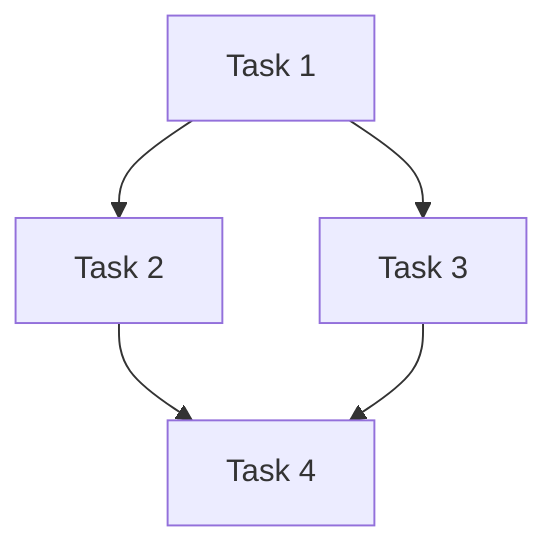

# Spec: prd-to-tasks 增量升级（站在 addyosmani/agent-skills + superpowers 两个巨人肩膀上）

## 背景与动机 · Background & Motivation

`skills/prd-to-tasks/SKILL.md` 现有 6 阶段架构（PRD 摄取 → 范围/风险 → 代码库扫描 → Spec → 任务拆解 → 工作流路由）能跑通主链路，但与上游两个开源 ecosystem（`addyosmani/agent-skills` + `obra/superpowers`）的对比显示，下列工程化能力还没引入：

- 门控是软描述，模型容易把"嗯/继续"当批准
- Spec 模板没有 Boundaries 三段（Always / Ask first / Never），约束分散在多节里
- Spec / 任务清单的产出路径与下游 `superpowers:writing-plans`、`cross-verified-feature-development` 没有机读契约
- 任务粒度只到 S/M/L，无 spec 反向引用，无任务 DAG 可视化
- Phase 1 PM 视角仅 3 个澄清问题，丢失"Not Doing / 成功指标 / 极端失败模式 / 回滚指标"等高价值范围信号

本次目标是**增量注入**这些能力，**保留现有 6 阶段架构**。

## 决策摘要 · Decision Summary

5 个增强主题全部纳入（用户在 brainstorming 中确认）：

| 主题 | 注入要点 |
|------|---------|
| **A. 门控刚性化** | `<HARD-GATE>` 语法 + Phase 1/3/4 gate 前自动自检 checklist + 显式有效批准 phrase 列表 |
| **B. PM/Spec 内容质量** | Phase 1 增加 10 项 PM 检查清单；Spec 模板增加 Boundaries 三段；Open Questions 升级为 owner+deadline 表 |
| **C. 路由 hand-off 契约** | Spec / 任务清单走固定路径 `docs/superpowers/specs/` 与 `plans/`（CWD 为根）；任务清单顶部带 YAML frontmatter，machine-readable 描述路由决定 |
| **D. 任务粒度与可执行性** | 尺寸刻度 XS–XL；每个 task 加 `spec-refs:` 反向引用；plan 文件顶部插入任务 DAG（mermaid）；Phase 4 gate 前完整性自检 |
| **E. 知识库外部化 + 开源清理** | repo-map / service-patterns 等映射文件作为用户可演进的 KB（默认 `~/.claude/prd-to-tasks/`，项目级覆盖），不再硬编码在 skill 仓库；skill 仓库内 `references/` 仅保留行业通用 seed，移除所有公司内部 API / 布局 / 拓扑 |

不变项：6 阶段架构、bilingual EN/ZH、风险定级矩阵（🔴/🟡/🟢）。

## 边界 · Boundaries

### Always do · 必做

- 所有产出文档（spec / 任务清单）都带 YAML frontmatter，machine-readable
- 每个门控 Phase 末尾用 `<HARD-GATE>` 包裹，禁止跳过
- 风险定级必须引用 Phase 1.3 矩阵的具体行号 + 至少一个备选定级的排除理由
- 任务清单中每个 task 通过 `spec-refs:` 反向引用 spec 的 Boundary / Invariant / 节号

### Ask first · 先问再做

- 修改 `cross-verified-feature-development` skill 的 contract（本 skill 是它的上游消费者）
- 改变默认产出路径（`docs/superpowers/specs/` 与 `plans/`）
- 改变 KB 加载顺序或加载路径协议（默认：项目级 → 用户级 → skill seed）
- 修改 KB 自动演进协议（默认：发现新映射时询问用户、永不静默写入）

### Never do · 严禁

- 合并 / 拆分 / 增减现有 6 阶段（用户已明确选择"增量注入"，架构不变）
- 把 Spec / plan 自动 commit（写入文件即可，commit 留给用户）
- 路由完成后自动 invoke 下游 skill（必须只输出建议命令，保留人在回路反悔窗口）
- 修改 `lark-cli docs +fetch` 调用（实测语法正确）
- 在开源 skill 仓库内出现任何公司内部 helper 函数名、内部 MQ broker 注册表、内部模块布局命名、内部 topic 命名 — 这类内容只能存在于用户本地 KB

## Phase-by-phase Deltas

### Phase 0: PRD 摄取

无改动。继续支持三种摄取：Lark URL / 粘贴文本 / 本地文件。

### Phase 1: 范围澄清与风险定级（gate）

**1.2 升级**：把现有 3 问模板替换为 10 项 PM 检查清单（见下）。

```markdown
### PM 范围澄清清单 · PM Scope-Clarity Checklist

| # | 维度 | 输出要求 |
|---|------|---------|
| 1 | **JTBD** | 谁在什么场景下用，要解决什么痛点 |
| 2 | **In scope** | 本期必做的可枚举能力清单 |
| 3 | **Not Doing** | 显式排除的能力 |
| 4 | **Deferred to v2** | 推迟到下一版的能力 + 推迟理由 |
| 5 | **成功指标** | 业务指标 + 技术指标，均需可量化 |
| 6 | **使用者主路径** | happy path 操作序列 |
| 7 | **极端失败模式** | 最坏情况 + 谁/什么受伤 + 影响半径 |
| 8 | **回滚指标** | 哪个 metric 超阈值触发回滚 + 谁决定 + 耗时 |
| 9 | **上下游依赖** | 其他团队/服务的同步要求 |
| 10 | **合规/审计** | PII / GDPR / 审计日志要求 |
```

**1.3 风险定级输出格式升级**：

```markdown
**风险定级初判：🔴 Critical** [触发：Phase 1.3 矩阵第 1 行]
**考虑过的备选**：🟡 High，但排除，因为 [...]
```

**Phase 1 gate 前自检**：

- [ ] 用了 Phase 1.3 矩阵具体行号
- [ ] 至少考虑了 1 个备选定级并写出排除理由
- [ ] 🔴 触发关键词显式列出
- [ ] PM 清单 10 项无未答项

### Phase 2: 代码库扫描

**改动 1**：扫描产出表加 `confidence` 列，标注每个文件的"确定/疑似/待确认"。

**改动 2**：扫描脚本前加一段说明："如目标语言的 LSP 可用（gopls / pyright / typescript-language-server），优先用 LSP 的 references/implementations 调用替代 grep"。这是软约束，不强求实现。

### Phase 3: Spec 生成（gate）

**Spec 模板改动**：

1. **新增 frontmatter**（文件最前）：

```yaml
---
feature: <kebab-case>
prd-source: lark://docx/xxx 或 docs/prd/xxx.md 或 inline
risk-level: 🔴 Critical | 🟡 High | 🟢 Standard
affected-repos: [...]
spec-status: draft | approved | superseded
created: YYYY-MM-DD
owner: <email>
---
```

2. **新增节：Boundaries 三段**（插在"技术方案"之后）：

```markdown
## 边界 · Boundaries

### Always do · 必做
- ...

### Ask first · 先问再做
- ...

### Never do · 严禁
- ...
```

3. **升级节：Open Questions 表**（替换原列表）：

| # | 问题 | 影响 | Owner | Deadline | 状态 |
|---|------|------|-------|----------|------|
| Q1 | ... | ... | @user | YYYY-MM-DD | open |

**Phase 3 gate 前自检**：

- [ ] Placeholder 扫描：无 "TBD" / "TODO" / "待确认" / "??"
- [ ] 内部一致性：技术方案 ↔ API 契约 ↔ 数据模型 无矛盾
- [ ] 范围一致性：Boundaries 三段 ↔ JTBD + In/Not Doing/v2 无矛盾
- [ ] 每条 Boundary / Invariant 至少映射到 1 个技术决策
- [ ] Open Questions 无 owner 缺失项；无 deadline 缺失项
- [ ] frontmatter 完整

**默认存放路径**：`docs/superpowers/specs/YYYY-MM-DD-<feature>-design.md`（以 CWD 为根）。

### Phase 4: 任务拆解（gate）

**改动 1：尺寸刻度从 S/M/L 扩展为 XS–XL**

| 标签 | 工时 | 何时用 |
|------|-----|--------|
| XS | < 30 min | 单文件 < 20 行 |
| S | 30 min – 2h | 单文件 < 100 行 |
| M | 2 – 4h | 单 Service + 测试 |
| L | 4 – 8h | 多文件协同 |
| XL | > 8h | **应进一步拆**；如保留必须写出"拆分被否决的理由" |

**改动 2：每个 task 加 `spec-refs:` 反向引用**

```markdown
### Task N: <动词 + 宾语>

**仓库 Repo**: ...
**文件 File**: ...
**类型 Type**: ...
**尺寸 Size**: XS / S / M / L / XL
**spec-refs**:
  - section: 技术方案        # 引用 spec h2 节标题
  - boundary: B-Always-1     # B-{Always|AskFirst|Never}-{序号}
  - invariant: I-3           # I-{序号}（来自 spec "不变式清单"）
[...]
```

**改动 3：plan 文件顶部插入任务 DAG（mermaid）**



**改动 4：Plan 文件 frontmatter（机读路由 header）**

```yaml
---
feature: <kebab-case>
risk-level: 🔴 Critical | 🟡 High | 🟢 Standard
routed-to: cross-verified-feature-development | superpowers:writing-plans | direct
spec: ../specs/YYYY-MM-DD-<feature>-design.md
routed-rationale: |
  Selected <skill> because [...]
  Considered <alternative> but rejected: [...]
  Expected cost: [...]
plan-status: ready-for-execution
phase-gate-approvals:
  phase-1: { approved-at: "YYYY-MM-DD HH:MM", phrase: "approve Phase 1" }
  phase-3: { approved-at: "YYYY-MM-DD HH:MM", phrase: "确认 Phase 3" }
  phase-4: { approved-at: "YYYY-MM-DD HH:MM", phrase: "Phase 4 OK" }
created: YYYY-MM-DD
created-by: <email>
---
```

**Phase 4 gate 前完整性自检**：

- [ ] Spec 中每条 Boundary / Invariant 都有 ≥1 task 通过 `spec-refs` 引用
- [ ] 每条 Failure Mode 都有对应的测试 task
- [ ] proto / shared-models 修改 task 排在所有消费者 task 之前
- [ ] online DDL / schema 迁移 task 排在所有逻辑 task 之前
- [ ] 无 XL 未拆分（或显式写出否决理由）
- [ ] 每个 task 有可执行的 `make build / test` 命令

**默认存放路径**：`docs/superpowers/plans/YYYY-MM-DD-<feature>-tasks.md`。

### Phase 5: 工作流路由

**路由不再是口头交付，而是 plan frontmatter 的 `routed-to:` 字段。**

下游消费契约：

| 下游 skill | 怎么用 header |
|-----------|--------------|
| `cross-verified-feature-development` | 校验 `routed-to == self`，读 `spec:` 文件作为 Phase 1 输入，task 清单作为 Phase 2 输入 |
| `superpowers:writing-plans` | 读 `spec:` 文件作为输入，把 task 清单转 superpowers plan 格式 |
| direct（🟢 Standard） | 用户人肉读 spec + 任务清单直接实施 |

**Phase 5 输出**：本 skill 不自动 invoke 下游，只输出建议命令，例如：

```
路由完成。spec 已落在 docs/superpowers/specs/2026-05-14-xxx-design.md，
任务清单已落在 docs/superpowers/plans/2026-05-14-xxx-tasks.md。

建议下一步：在新会话中运行
  /cross-verified-workflow
让它读取上述两个文件继续。
```

理由：跨阶段切换是天然 review point，自动 invoke 会让用户失去最后一次反悔窗口。

## HARD-GATE 语法

应用于 Phase 1 / 3 / 4 三个门控末尾（Phase 5 是路由决定本身，用户即决策者，无 gate 后续概念；Phase 0/2 是信息处理，无 gate）：

```markdown
<HARD-GATE>
不得进入 Phase N+1，除非用户**显式**输入有效批准信号。
有效信号：「approve Phase N」/「确认 Phase N」/「Phase N OK，继续」。
无效信号（仅为会话寒暄，禁止当作批准）：
  「看起来不错」「continue」「嗯」「ok」「好的」「就这样」。
</HARD-GATE>
```

## 文件契约 · File Contract

CWD 为根，下游 skill 凭固定路径取货：

```
<CWD>/
└── docs/superpowers/
    ├── specs/
    │   └── YYYY-MM-DD-<feature>-design.md        # Phase 3 产出
    └── plans/
        └── YYYY-MM-DD-<feature>-tasks.md          # Phase 4 产出（含路由 header）
```

## 知识库 · Knowledge Base

`repo-map` 与 `service-patterns` 等映射不再硬编码到 skill 仓库——它们是**用户可演进的知识库**，因为每家公司、每个团队的代码仓库布局和内部代码模式都不同。

### 加载顺序（首找优先 / 同 key 后者不覆盖）

```
1. <CWD>/.claude/prd-to-tasks/*.md       # 项目级（团队共享、随代码仓库 git 管理）
2. ~/.claude/prd-to-tasks/*.md           # 用户级（跨项目积累的个人 KB）
3. <skill>/references/*.md               # skill 仓库自带 seed（只读、行业通用例子）
```

### KB 目录文件清单（不固定，按需扩展）

skill 在加载时枚举 KB 目录下所有 `*.md` 文件，常见但不限于：

| 文件 | 内容 | 何时被读 |
|------|-----|---------|
| `repo-map.md` | 需求信号 → 受影响服务/仓库 | Phase 1.1 |
| `service-patterns.md` | 内部代码模式（ID 生成、缓存失效、MQ topic 注册 等） | Phase 4 任务拆解检查项 |
| `<custom>.md` | 用户自定义（例 `state-machine-conventions.md`、`team-owners.md`） | 全局，模型自行判断何时引用 |

### Bootstrap 协议

Phase 0 摄取完 PRD 后，本 skill 检测 KB 目录：

- 若 `<CWD>/.claude/prd-to-tasks/` 或 `~/.claude/prd-to-tasks/` 存在 → 直接使用
- 若都不存在 → 提示用户：
  ```
  KB 目录未找到。建议运行：
    mkdir -p ~/.claude/prd-to-tasks
    cp <skill>/references/*.md ~/.claude/prd-to-tasks/
  然后按你的代码库改写。或选择跳过（继续但 Phase 1.1 / Phase 4 检查项能力会受限）。
  ```

### 演进协议

- Phase 2 代码库扫描末尾：如果发现的服务/模式在当前已加载的 KB 中**没有对应条目**，列出"候选新条目"清单，提示用户：
  ```
  发现以下新映射，要追加到 ~/.claude/prd-to-tasks/repo-map.md 吗？
  - "<requirement-signal>" → <service-name>
  ```
- 用户必须**显式同意**（同 HARD-GATE 协议）才会写入
- 本 skill **永不静默写入 KB**

### Skill 仓库自带 seed 的角色

`skills/prd-to-tasks/references/*.md` 重新定位为**行业通用例子 + 格式模板**：

- 内容只包含通用 e-commerce / SaaS 词汇（`order-service`、`payment-service`、`bff-service`、`inventory-service` 等行业标准命名）
- 抽象的代码模式原则（"use your company's centralized ID generator helper, not auto-increment"），不引用具体 API 名
- 每个文件顶部带 banner：`> Generic example. Copy to ~/.claude/prd-to-tasks/ and customize for your stack.`
- 公司内部 helper 函数、内部缓存/失效协议、内部 MQ 注册表、内部 topic 命名等具体实现细节 **严禁**出现

## 不变式 · Invariants

- I-1：每个 Phase 1/3/4 门控必须由用户显式 phrase 批准（Phase 5 是路由决定本身，由用户作为决策者）
- I-2：Spec 与 plan 文件 frontmatter 必须 YAML 格式且字段完整
- I-3：Plan 文件 `routed-to:` 值只能取三个固定值之一
- I-4：本 skill 永不自动 invoke 下游 skill
- I-5：本 skill 永不自动 git commit 产出文件
- I-6：本 skill 永不静默写入 KB；任何 KB 变更必须先 diff 给用户并显式同意
- I-7：开源 skill 仓库内的 `references/*.md` 严禁含公司内部 API / 内部 topic / 内部布局命名

## 失败模式分析 · Failure Mode Analysis

| 失败模式 | 触发场景 | 缓解 |
|---------|---------|-----|
| 用户的"ok"被错误当作 gate 批准 | LLM 推理偏差 | HARD-GATE 显式列出无效短语，强制要求复述并求确认 |
| Spec 自检漏过 placeholder | 自检 checklist 不严 | checklist 用机械 grep（如 `TBD\|TODO\|待确认\|??`）而非语义判断 |
| Plan header 字段被下游 skill 解析失败 | YAML 格式错 | 写完后用 `yq` 或 python yaml 解析校验一次（如 yq 不可用则手动 grep 校验关键字段） |
| 跨仓 spec 路径错位 | 用户在错的 CWD 跑了 skill | Phase 0 末尾打印当前 CWD 给用户确认 |
| LSP 不可用时降级提示丢失 | 代码扫描阶段 | 扫描脚本前明确"如 LSP 可用优先 LSP，否则 fallback grep+find" |
| KB 加载顺序错误 / 三层 path 解析失败 | Phase 0 / Phase 1 | Bootstrap 协议在加载前打印实际生效的 KB 路径列表给用户确认 |
| 用户的公司内部私有 KB 内容被误推到开源 repo | Phase 4 / 用户操作 | I-7 不变式 + Phase 4 自检 checklist 增加一条："scan plan/spec/任务 中无公司内部 helper / 内部 topic / 内部布局命名" |

## 部署策略 · Deployment Strategy

- [x] **直接生效**（本 skill 文件级修改，无运行时）
- [ ] Feature Flag
- [ ] 灰度
- [ ] 双写切换

## 风险层级 · Risk Level

🟡 **High**（命中 Phase 1.3 第 2 行：估算 ≥ 3 人日 + 多组件协调）

考虑过 🟢 Standard 但排除：本次修改影响 Spec / Plan 两个产出契约，下游 `cross-verified-feature-development` 与 `superpowers:writing-plans` 都依赖这些契约，错误会传染到所有后续使用本 skill 的项目。

考虑过 🔴 Critical 但排除：无资金流 / 状态机 / 分布式锁 / online schema 语义。

## 回滚标准 · Rollback Criteria

- 路由 header 解析在下游 skill 中失败率 > 10% → 回滚到本次修改前的 SKILL.md
- 用户在 brainstorming 中反馈"门控过严以至无法推进" → 降级 HARD-GATE 措辞
- 决定人：magebyte-zero

## 成功标准 · Success Criteria

- 一个完整 PRD → Tasks → 下游 skill 链路跑通 1 次，全程无路径错位、无 frontmatter 解析失败
- 至少有 1 个 PRD 在 Phase 1 因为 PM 检查清单暴露出"Not Doing / 回滚指标"层面的盲点（验证清单的价值）
- 至少有 1 个 task 因为 `spec-refs` 反向引用机制被发现"漏拆"（验证完整性自检的价值）

## 遗留问题 · Open Questions

| # | 问题 | 影响 | Owner | Deadline | 状态 |
|---|------|------|-------|----------|------|
| Q1 | XL task 不拆的"否决理由"是否要给出固定模板？ | 影响 Phase 4 自检严格度 | magebyte-zero | 2026-05-21 | open |
| Q2 | Plan header 是否需要 `superseded-by:` 字段记录被新版替代的情况？ | 影响多版本 spec 共存 | magebyte-zero | 2026-05-21 | open |
| Q3 | 是否在 README 增加"prd-to-tasks v2 升级"条目？ | 文档可见性 | magebyte-zero | 实施完成时 | open |
| Q4 | KB 三层加载冲突时的 merge 策略：同名 key 项目级覆盖用户级 (override) vs 合并展示 (merge)？我建议 override（清晰）但需确认 | 影响 Phase 1/2 加载语义 | magebyte-zero | 2026-05-21 | open |
| Q5 | seed `references/*.md` 重写时用什么 industry-neutral domain？建议通用 e-commerce（订单/支付/库存/通知），也可用 SaaS（认证/计费/通知） | 影响 seed 文档示例感知 | magebyte-zero | 2026-05-21 | open |

## Not Doing（本期显式排除）

- 不重新设计 6 阶段架构
- 不自动 commit 产出文件
- 不自动 invoke 下游 skill
- 不强制 TDD 节奏到 task 级别（只保留"验证命令"块）
- 不修改 `cross-verified-feature-development` skill
- 不增加 LSP 工具的强依赖（仅作为可选优先级提示）
- 不实现 KB 跨用户/跨机器同步（无远端 sync；用户 KB 是本地文件）
- 不为 KB 引入文件锁、版本号、schema 校验（KB 是 markdown，人读为主）
